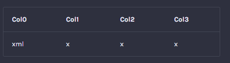

# MKDOCS CUSTOM FENCES

This package is for mkdocs and include some "code snippet" to create custom fences using [pydownx superfences](https://facelessuser.github.io/pymdown-extensions/extensions/superfences/). This allow to customize your code blocks during the processor of your mkdocs. 

For the moment, it includes only [md_render](#Markdown-Render).

# Get started
`pip install mkdocs_custom_fences`  
After the installation you should be able to access the extensions in `mkdocs.yml` using `mkdocs_custom_fences.file.class`. See below for more information using configuration. 

## Mkdocs configuration

In your `mkdocs.yml` configuration you need to configure superfences to use custom fences.
```yaml
markdow_extensions:
  pymdownx.superfences:
      custom_fences:
        - name: language
          class: language
          format: !!python/name:mkdocs_custom_fences.file.class
```

# Markdown Render
→ Configuration : `!!python/name:mkdocs_custom_fences.md_render.md_sub_render`
This custom formattor allow you to "force" markdown and remove the code block. 

Add this in your configuration :
```yaml
markdow_extensions:
  pymdownx.superfences:
      custom_fences:
        - name: md-render
          class: md-render
          format: !!python/name:mkdocs_custom_fences.md_render.md_sub_render
```
💡You can customize the name and class with any language you want.

Example : 
```
    ```md-render
    |Col0|Col1|Col2|Col3|
    |----|----|----|----|
    |xml |x|x|x|
    ```
```
Will become : 



# Contribution
I will be happy to see any new configuration and custom fences. 

To contribute :
- Fork and clone this project
- `pip install -r requirements.txt` (I advice you to use virtual environment ; personnaly I use conda.)
- Create a new file (don't use any already custom fences for new customization). Don't forget to update the requirements.txt if you need).
- Edit this README to add an example and the configuration.
- Add the custom fences to [the list](docs/custom_fences_list.md).
- Create a pull request

⚠️ You need to use [**conventionnal commit** as described here](https://www.conventionalcommits.org/en/v1.0.0/#summary)


